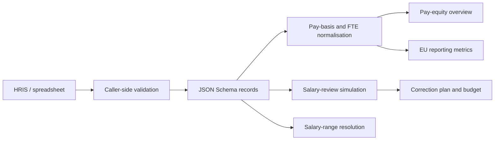

# Architecture

The package is intentionally a pure calculation boundary. It reads arrays and
objects, returns new arrays and result objects, and performs no I/O. A host
application supplies identity, permissions, tenant scoping, persistence,
currency selection, historic state and export formatting.

`src/index.js` is the stable entry point. The other modules remain available
as subpath exports for consumers that need lower-level primitives.

The public repository contains a snapshot of reviewed source files rather than
the private application's Git history. This prevents application deployment
metadata and unrelated product code from entering the public trust boundary.
